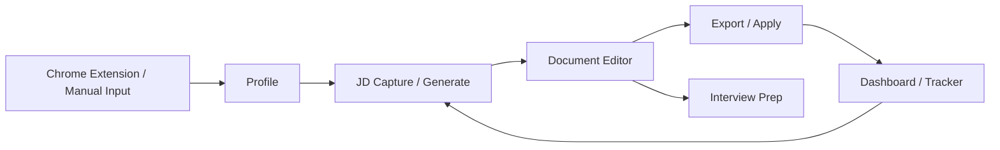
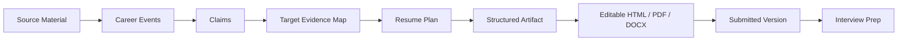

# OfferMax Research And Differentiation

Date: 2026-06-29

## Research Scope

This research is based on:

- Logged-in OfferMax product pages inspected on 2026-06-29: `/profile`, `/generate`, `/editor`, `/interview-prep`.
- Public OfferMax landing page.
- Our existing `career-timeline` and `career-application` skills.

Public search results were sparse, so the strongest evidence is the logged-in product UI and the public homepage.

## OfferMax Product Loop

OfferMax is not only a resume generator. Its loop is:

## OfferMax Pages Observed

### Profile

Purpose: build a durable career profile once, then reuse it for every application.

Observed capabilities:

- Upload materials: resume/CV, cover letters, performance reviews, certificates, LinkedIn export.
- Add personal links.
- Store standard application answers, including work authorization, sponsorship, EEO fields, pronouns.
- Paste supplementary information and re-analyze profile.
- Render structured profile sections:
  - Basic contact card
  - Professional summary
  - Experience
  - Education
  - Skills
  - Projects
  - Courses
  - Awards and honors
  - Publications
  - Patents
  - Volunteer experience
  - Languages
  - Custom sections
- Edit profile fields in an inline editing panel.
- Add bullets, roles, custom sections.
- Custom section supports title, format, and whether it should be included in generated resume.
- Sections and items show source markers.
- Backup and restore profile file.

### Generate

Purpose: turn profile plus JD into tailored application documents.

Observed capabilities:

- Document types:
  - Resume
  - Cover Letter
  - Intro Email
  - LinkedIn DM
  - Connect Note
  - Referral Q&A
- Template styles:
  - Modern
  - Classic
  - Minimal
  - Creative
- Section presets by experience level:
  - 0 YoE
  - 1-3 YoE
  - 4+ YoE
- Section inclusion checkboxes.
- Resume layout ordering.
- Per-section "AI picks" controls.
- Fine-tune bullets.
- JD URL fetch and raw JD paste.
- Additional instructions.
- Right-side document preview/output area.

### Editor

Purpose: manage and iterate generated documents.

Observed capabilities:

- Left document list.
- Current document title and saved status.
- Template switcher.
- Preview / Edit / Source modes.
- Undo last AI edit.
- Reset to original.
- Copy markdown.
- PDF export.
- Filename settings.
- A4 exact preview iframe.
- AI Edit Assistant with freeform instruction input.
- Preset edit prompts:
  - Make it more concise.
  - Use stronger action verbs.
  - Add more quantified achievements.
  - Make tone more confident.
  - Fix grammar and flow.
  - Add industry keywords.

### Interview Prep

Purpose: prepare for interviews based on the resume version actually submitted.

Observed capabilities:

- Left document list.
- User selects or drags a resume into preparation area.
- Prep is grounded in that specific resume, not only the generic profile.

## OfferMax Strengths To Learn

- One durable profile powers all downstream work.
- Users can edit every field manually after AI parsing.
- Fixed profile sections plus custom sections cover common and unusual careers.
- Generation is configurable before AI runs.
- Editor treats generated documents as versioned artifacts, not disposable text.
- Interview prep is tied to the submitted document version.
- Product navigation is simple: Profile, Generate, Editor, Interview Prep.

## OfferMax Gaps We Can Surpass

### 1. Evidence And Review Discipline

OfferMax shows source markers, but the UI does not make evidence review central.

Our advantage from `career-timeline`:

- Preserve raw sources before extraction.
- Extract granular career events.
- Mark uncertain fields as `needs_review`.
- Require review cards before facts become trusted.
- Keep event status: draft, needs_review, confirmed, archived.
- Keep evidence links per event and claim.

### 2. Target-First Application Strategy

OfferMax starts generation from JD and controls, but it does not expose a rigorous target strategy stage.

Our advantage from `career-application`:

- Research target before drafting.
- Choose sections before selecting events.
- Map events and claims to JD requirements.
- Show selected and omitted evidence.
- Require approval before drafting.
- Generate structured artifacts first, then render.

### 3. Safer Claims

OfferMax can make writing stronger, but a mature product must prevent unsupported inflation.

Our advantage:

- Every claim can point back to a source.
- Unsupported or inferred claims can be shown as temporary suggestions.
- Resume generation can be restricted to confirmed events unless user approves weaker evidence.

### 4. Chinese Job Market Fit

OfferMax is US-centric.

Our advantage:

- Domestic channels: Boss, Liepin, Zhilian, 51job, Lagou, Niuke, Shixiseng, Maimai, company career sites.
- Chinese resume conventions.
- Chinese-English bilingual artifacts.
- Interview prep for technical deep dives, HR rounds, project challenges, written tests, and school recruitment.

### 5. Structured Development Process

OfferMax is a product reference. We should not copy its code or UI blindly.

Our route:

## Product Principle

We should imitate OfferMax's product completeness and interaction clarity, but the internal logic should remain ours:

> OfferMax-like surface, career-timeline evidence model, career-application target-first workflow.

