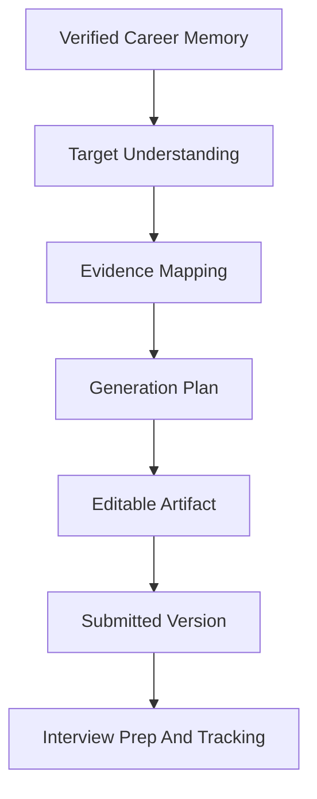
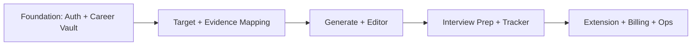

# Product Strategy V2

## Product Name

Working name: Career Copilot CN.

## Product Positioning

Career Copilot CN is a serious AI job application workspace for Chinese and global job seekers.

It is not a prompt wrapper and not a one-shot resume generator. It manages durable career facts, job targets, generated documents, application progress, and interview preparation.

## Core Thesis

Most AI resume tools fail because they start from "generate a resume". A mature job application product should start from verified career memory and target-specific evidence selection.

## Product Pillars

### 1. Career Vault

The source of truth for the user's professional history.

It stores:

- Raw materials.
- Profile basics.
- Structured career events.
- Reusable claims.
- Evidence.
- Review status.
- Visibility rules.

### 2. Application Workspace

One job target should have one workspace.

It stores:

- JD and source URL.
- Company and role context.
- Match analysis.
- Evidence map.
- Generated artifacts.
- Submission status.
- Interview prep.

### 3. Artifact Editor

Generated documents must be editable, versioned, and exportable.

The editor stores:

- Structured artifact JSON.
- Rendered preview.
- AI edit history.
- Export versions.
- Submitted version markers.

### 4. Interview Prep

Interview prep must be grounded in:

- The actual JD.
- The actual resume version submitted.
- Confirmed career events and claims.

### 5. Tracking And Feedback

The product should learn from job outcomes.

It should track:

- Applications.
- Interview rounds.
- Rejections and offer outcomes.
- Which resume versions were used.
- Which positioning worked.

## Target Users

### Primary Users

- Chinese students applying for internships, school recruitment, or overseas roles.
- Early-career engineers, product managers, data/AI practitioners, and analysts.
- Candidates applying across many platforms and needing structured tracking.

### Secondary Users

- Mid-career professionals changing direction.
- International students adapting between Chinese and English resumes.
- Users who want a long-term professional memory layer for AI agents.

## We Are Not Building

For V2 planning, the product should not become:

- A generic Notion clone.
- A resume template marketplace.
- A fully autonomous job applier that submits without confirmation.
- A social network.
- A recruiter CRM.

## Differentiation

| Area | OfferMax Reference | Our V2 Direction |
| --- | --- | --- |
| Profile | Structured editable profile | Evidence-backed Career Vault |
| Upload | AI parses materials | Raw source preservation plus review queue |
| Generation | Configurable resume/document generation | Target research, evidence map, plan approval, then generation |
| Editor | A4 preview and AI edit assistant | Versioned structured artifacts with source traceability |
| Interview Prep | Resume-based prep | JD + submitted resume + confirmed event evidence |
| Domestic Fit | US job boards and EEO | Chinese platforms, bilingual artifacts, domestic interview workflows |
| Safety | Privacy-first claim | Evidence, status, visibility, export/delete controls |

## Maturity Standard

This is not an MVP spec. It should define the mature product even if implementation is phased.

Each core capability must specify:

- User value.
- Page/state behavior.
- Data model.
- API dependency.
- AI pipeline dependency.
- Error and empty states.
- What requires user confirmation.

## Recommended Development Philosophy

Design the complete product now, then implement in phases.

Phase order:

Do not start with the resume generator alone. If Career Vault and target evidence mapping are weak, every generated document will become hard to trust and hard to improve.

