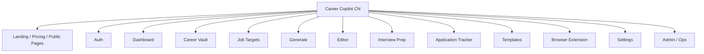
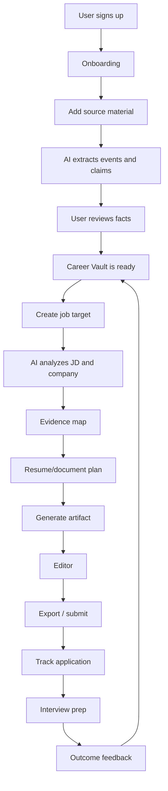

# Information Architecture V2

## Top-Level Navigation



## App Shell

Primary app navigation:

- Dashboard
- Career Vault
- Job Targets
- Generate
- Editor
- Interview Prep
- Tracker
- Settings

Secondary global actions:

- Add material
- Add job target
- Generate document
- Search
- Notifications
- Account menu

## Page Ownership

| Area | Primary Object | Main User Question |
| --- | --- | --- |
| Dashboard | Workspace summary | What should I do next? |
| Career Vault | Source, event, claim, profile | What does the system know about me? |
| Job Targets | Job target | Which roles am I applying to? |
| Generate | Artifact request | What should I generate for this job? |
| Editor | Artifact version | Is this document ready to submit? |
| Interview Prep | Interview prep set | How do I prepare for this specific interview? |
| Tracker | Application | What is the status of each application? |
| Settings | Account and data | How is my account, data, and AI usage configured? |

## Suggested URL Structure

```text
/
/pricing
/privacy
/login
/signup

/app
/app/dashboard
/app/vault
/app/vault/sources
/app/vault/events
/app/vault/claims
/app/vault/profile
/app/vault/review

/app/jobs
/app/jobs/new
/app/jobs/:jobId
/app/jobs/:jobId/analysis
/app/jobs/:jobId/evidence
/app/jobs/:jobId/generate
/app/jobs/:jobId/artifacts
/app/jobs/:jobId/interview

/app/generate
/app/editor
/app/editor/:artifactId
/app/interview-prep
/app/tracker
/app/templates
/app/extension
/app/settings
/app/settings/account
/app/settings/ai
/app/settings/privacy
/app/settings/billing

/admin
```

## Mature Product Flow



## Product Modules

### Landing And Auth

Public education, trust, pricing, privacy, signup, login.

### Dashboard

Command center for job-hunt progress and next actions.

### Career Vault

Long-term career memory:

- Sources
- Events
- Claims
- Profile
- Review queue
- Evidence library

### Job Targets

Role-specific workspace:

- JD capture
- Match analysis
- Company notes
- Evidence mapping
- Application status

### Generate

Artifact configuration and generation:

- Document type
- Language
- Template
- Section inclusion
- Evidence controls
- Additional instructions

### Editor

Document iteration and export:

- Preview
- Structured edit
- Source view
- AI edit assistant
- Version history
- PDF/DOCX/Markdown/TXT export

### Interview Prep

Role and artifact grounded interview preparation:

- Question prediction
- STAR answers
- Project deep dive cards
- Resume challenge questions
- Review checklist

### Tracker

Application pipeline:

- Kanban
- Table
- Calendar
- Status history
- Next actions

### Extension

Browser companion:

- JD capture
- Application field assistance
- Quick generation
- Match score sidebar

### Settings

Account, AI providers, privacy, billing, export/delete.

### Admin

Operational tools for SaaS:

- User support
- AI job queue
- Model call logs
- Failed exports
- Usage and billing events

