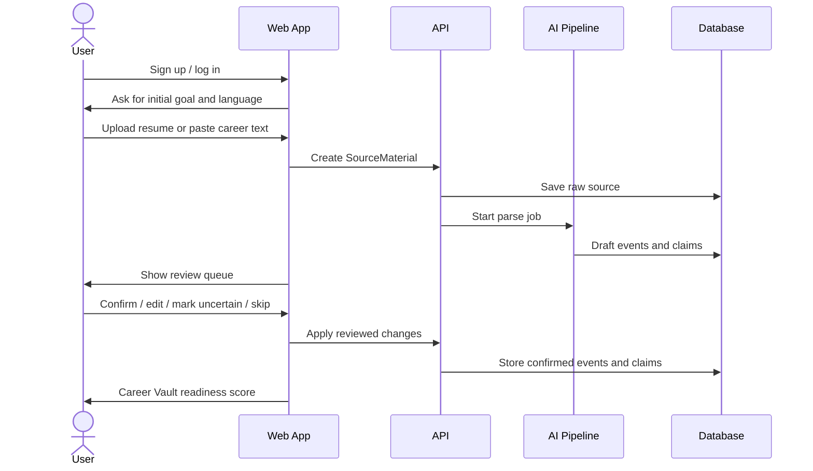
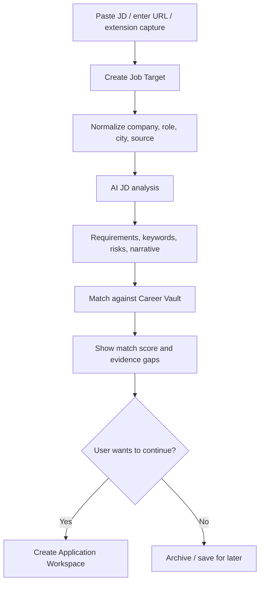
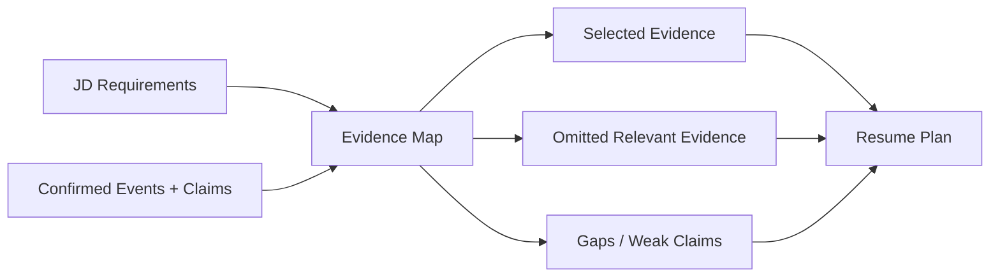
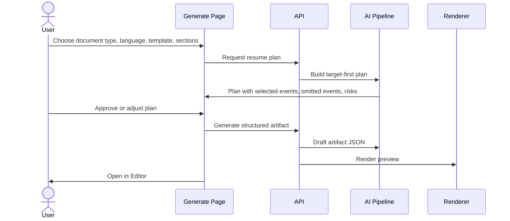
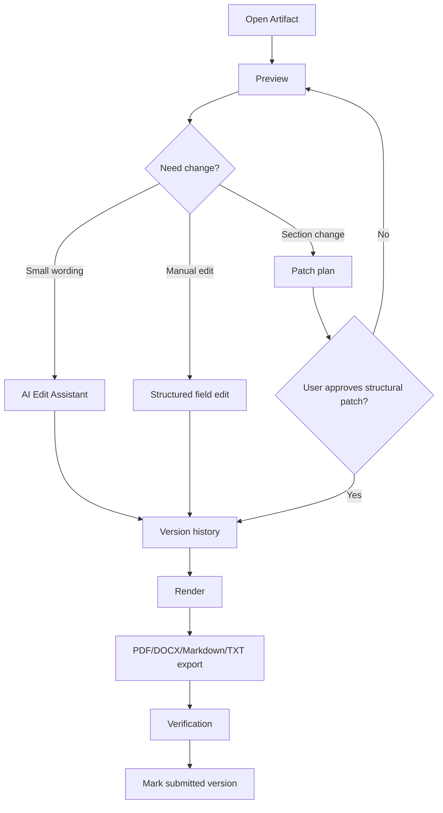
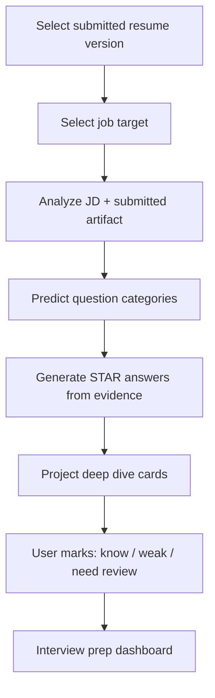
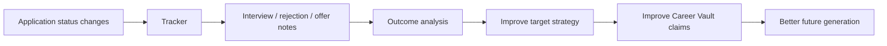

# User Flows V2

## Flow 1: Onboarding To Career Vault Readiness

Key rule from `career-timeline`: raw source must be saved before AI extraction. Draft facts must not silently become trusted facts.

## Flow 2: Add Job Target

Key rule from `career-application`: target understanding comes before resume writing.

## Flow 3: Evidence Mapping

The user must see which evidence will be used before generation.

## Flow 4: Generate Resume

Key rule from `career-application`: do not jump directly from JD to final resume. Plan first.

## Flow 5: Editor And Export

PDF export must be verified for page count, text layer, contact fields, and truncation.

## Flow 6: Interview Prep

Interview prep should never be detached from the resume version that was actually submitted.

## Flow 7: Tracker Feedback Loop

## Confirmation Gates

The product must ask for explicit user approval before:

- Storing AI-extracted draft facts as confirmed facts.
- Using weak or inferred claims in a formal application.
- Applying structural document patches.
- Exporting final application material.
- Auto-filling or submitting fields through the browser extension.
- Deleting source materials, events, claims, artifacts, or account data.

No explicit approval is needed for:

- Saving raw uploaded material the user selected.
- Creating draft AI suggestions.
- Showing match analysis.
- Rendering previews.
- Running non-destructive verification.

