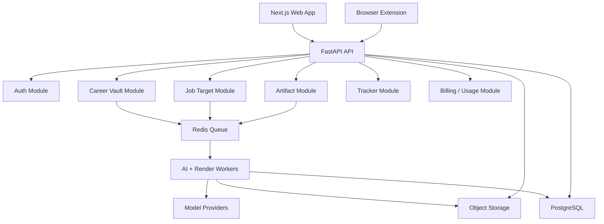

# Backend Architecture V2

## Recommendation

Use the current direction:

- Next.js frontend.
- FastAPI backend.
- PostgreSQL as primary database.
- SQLAlchemy or SQLModel.
- Redis for queues, locks, rate limits.
- Object storage for uploads and exports.
- Background workers for parsing, generation, rendering, and exports.
- pgvector later for semantic retrieval.

This preserves our Python advantage for AI workflows, PDF/DOCX parsing, rendering, and skill-inspired structured pipelines.

## Service Boundaries

## Modules

### Auth

- Email/password.
- Phone code.
- Session/JWT.
- User identity.
- Rate limiting.

### Career Vault

- Profile basics.
- Source materials.
- Event extraction.
- Claim extraction.
- Evidence.
- Review queue.

### Job Target

- JD capture.
- Job metadata.
- JD analysis.
- Match score.
- Evidence map.

### Artifact

- Generate plan.
- Generate structured artifact.
- Render preview.
- AI edits.
- Version history.
- Export files.

### Tracker

- Application status.
- Interview rounds.
- Outcome notes.
- Activity history.

### AI Orchestrator

- Prompt templates.
- Structured schemas.
- Model provider routing.
- Job status and retries.
- Cost tracking.
- Safety checks.

### Render Worker

- HTML preview.
- PDF export.
- DOCX export.
- Verification.

## Background Jobs

| Job | Trigger | Output |
| --- | --- | --- |
| source_parse | User adds source | Draft events and claims |
| vault_readiness | Source/event changes | Readiness score |
| jd_analyze | User creates job | JD analysis |
| match_score | JD analysis ready | Score and gaps |
| evidence_map | User requests plan | Selected evidence |
| artifact_plan | User opens Generate | Resume/document plan |
| artifact_generate | User approves plan | Artifact version |
| artifact_ai_edit | User requests edit | New artifact version |
| export_pdf | User exports | PDF and verification |
| interview_prep | User selects submitted version | Questions and answers |

## Error Handling

Every background job should store:

- Status: queued, running, succeeded, failed, canceled.
- Progress message.
- Error code.
- User-safe error message.
- Retry count.
- Input references, not full duplicated raw text where avoidable.
- Output references.

## Security And Privacy

Minimum requirements:

- User-scoped queries everywhere.
- No global profile/event lookup.
- Uploaded files scoped by user.
- Signed object storage URLs.
- Audit destructive actions.
- AI logs must not store full raw source by default.
- Admin raw data access must be exceptional and audited.

## Environments

### Local Development

- SQLite is acceptable only for early local experiments.
- Local file storage is acceptable.
- Redis optional if jobs can run inline in dev.

### Production

- PostgreSQL.
- Redis.
- Object storage.
- Worker process.
- HTTPS.
- Observability.
- Backups.

## Existing Code Migration

Keep:

- FastAPI foundation.
- Next.js foundation.
- Basic source/event/profile ideas.
- Event edit modal patterns if reusable.

Rewrite:

- Auth.
- User scoping.
- Data model.
- Vault page architecture.
- API contracts.

Do not delete old code blindly. Mark it as prototype and replace module by module.

