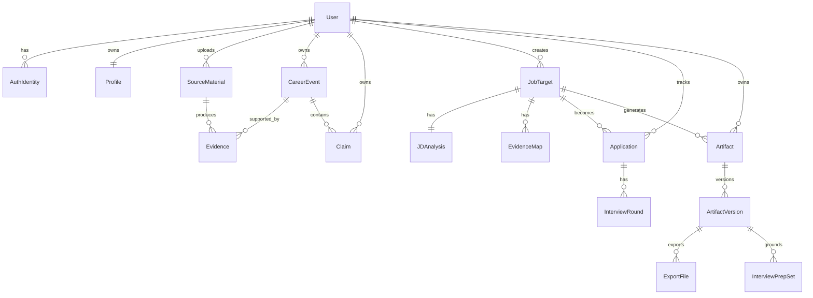

# Data Model V2

## Core ERD

## User

- id
- display_name
- email
- phone
- avatar_url
- locale
- timezone
- created_at
- updated_at
- deleted_at

## AuthIdentity

- id
- user_id
- provider: email, phone, wechat, google, github
- provider_subject
- password_hash
- verified_at
- created_at

## Profile

- id
- user_id
- full_name
- headline
- emails
- phones
- location
- target_locations
- links
- summary
- years_of_experience
- language_preferences
- application_answers_json
- updated_at

## SourceMaterial

- id
- user_id
- type: file, text, url, extension_capture, backup_restore, agent_session
- title
- raw_text
- file_url
- source_url
- mime_type
- parse_status
- metadata_json
- created_at

## CareerEvent

- id
- user_id
- type
- title
- role
- organization
- location
- start_date
- end_date
- date_precision
- description
- details_json
- tags
- status: draft, needs_review, confirmed, archived
- visibility: private, resume, public
- source_confidence
- created_at
- updated_at

## Claim

- id
- user_id
- career_event_id
- claim_text
- claim_type: skill, achievement, metric, responsibility, credential, preference
- strength: confirmed, inferred, weak
- visibility
- created_at

## Evidence

- id
- user_id
- source_material_id
- career_event_id
- claim_id
- quote
- locator_json
- confidence
- created_at

## JobTarget

- id
- user_id
- company
- role
- city
- work_mode
- industry
- source_url
- channel
- raw_jd
- deadline
- priority
- status
- tags
- created_at
- updated_at

## JDAnalysis

- id
- job_target_id
- responsibilities_json
- must_have_json
- nice_to_have_json
- keywords_json
- company_context
- screening_criteria_json
- risks_json
- recommended_narrative
- created_at

## EvidenceMap

- id
- job_target_id
- requirement_id
- selected_event_ids
- selected_claim_ids
- omitted_event_ids
- gaps_json
- rationale
- created_at

## Artifact

- id
- user_id
- job_target_id
- type: resume, cover_letter, email, dm, referral_qa, interview_intro
- title
- language
- template
- current_version_id
- submitted_version_id
- created_at
- updated_at

## ArtifactVersion

- id
- artifact_id
- version_number
- structured_json
- markdown
- html
- source_map_json
- change_summary
- created_by: user, ai, system
- created_at

## ExportFile

- id
- artifact_version_id
- format: pdf, docx, markdown, html, txt, json
- file_url
- verification_json
- created_at

## Application

- id
- user_id
- job_target_id
- status
- applied_at
- resume_artifact_version_id
- channel
- contact_person
- next_action
- notes
- outcome_reason
- created_at
- updated_at

## InterviewPrepSet

- id
- user_id
- job_target_id
- artifact_version_id
- status
- summary
- created_at

## InterviewQuestion

- id
- prep_set_id
- category
- question
- answer_draft
- evidence_refs_json
- user_status: new, know, weak, needs_review
- created_at

## Design Notes

- `CareerEvent` is intentionally granular. One job can contain multiple project-like events later.
- `ArtifactVersion` stores structured JSON as the source of truth; HTML/PDF are render outputs.
- `Evidence` connects source material to events and claims. This is our advantage over basic profile builders.
- `Application` references the exact submitted artifact version.
- `InterviewPrepSet` also references the exact artifact version.

