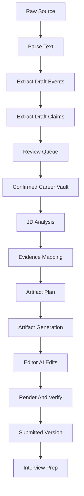

# AI Pipeline V2

## Pipeline Principles

The AI layer must preserve the strengths of our skill route:

- Save raw material first.
- Extract structured facts.
- Keep uncertainty visible.
- Ask for user review before confirmation.
- Select evidence before writing.
- Generate structured artifacts before rendering.
- Verify exports.

## Pipeline Overview



## Source Parse

Input:

- SourceMaterial id.
- Raw text or file reference.
- Existing user profile context.

Output:

- Draft CareerEvents.
- Draft Claims.
- Evidence references.
- Parse warnings.

Rules:

- Do not invent missing dates, employers, metrics, awards, or degrees.
- Mark uncertain fields.
- Extract granular events.
- Keep original source references.

## Vault Readiness

Output:

- Missing profile basics.
- Number of confirmed events.
- Number of needs_review events.
- Evidence coverage.
- Suggested next action.

## JD Analysis

Input:

- Raw JD.
- Company.
- Role.
- Optional source URL.

Output:

- Responsibilities.
- Must-have requirements.
- Nice-to-have requirements.
- Keywords.
- Screening criteria.
- Risks.
- Recommended positioning.

## Match Score

Inputs:

- JDAnalysis.
- Confirmed events and claims.

Output:

- Overall score.
- Requirement-level match.
- Strong evidence.
- Weak evidence.
- Missing evidence.
- Recommendation: apply, maybe, low fit.

## Evidence Mapping

Inputs:

- JDAnalysis.
- CareerEvents.
- Claims.

Output:

- Selected events.
- Selected claims.
- Omitted relevant evidence.
- Gaps.
- Rationale.

This is the bridge from `career-timeline` to `career-application`.

## Artifact Plan

Output:

- Positioning sentence.
- Section order.
- Section goals.
- Events per section.
- Claims per section.
- Omitted events.
- Page risk.
- Exaggeration risk.

User approval is required before generation.

## Artifact Generation

Output should be structured JSON:

```json
{
  "type": "resume",
  "language": "zh-CN",
  "sections": [
    {
      "id": "summary",
      "title": "Summary",
      "items": []
    }
  ],
  "source_map": []
}
```

Do not generate only freeform Markdown as the source of truth.

## AI Edit

Input:

- ArtifactVersion.
- User instruction.
- Scope: document, section, item, bullet.

Output:

- Patch operation.
- New artifact version.
- Change summary.
- Source map update.

Structural patches require user confirmation.

## Render And Verify

Renderer outputs:

- HTML preview.
- PDF.
- DOCX.
- Markdown.
- TXT.

Verification checks:

- Page count.
- Text layer.
- Contact fields.
- Truncation.
- Export file exists.

## Interview Prep

Inputs:

- JobTarget.
- Submitted ArtifactVersion.
- Confirmed CareerEvents.

Outputs:

- Question categories.
- Questions.
- STAR answer drafts.
- Evidence references.
- Project deep dive cards.
- Weak areas.

## Prompt And Schema Assets

Keep prompt assets versioned:

```text
docs/product-v2/ai-schemas/
docs/product-v2/ai-prompts/
```

Core schemas needed:

- source_parse_result.schema.json
- career_event.schema.json
- claim.schema.json
- jd_analysis.schema.json
- evidence_map.schema.json
- artifact_plan.schema.json
- artifact.schema.json
- ai_edit_patch.schema.json
- interview_prep.schema.json

