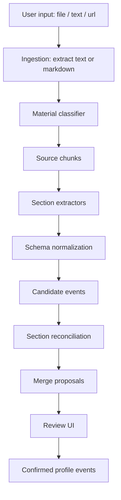

# Vault Parsing And Reconciliation Design

## 1. Goal

Career Vault 的核心能力不是“把一份简历转成一堆卡片”，而是把用户持续输入的简历、文字、链接和后续材料，沉淀成可编辑、可追溯、可复用的职业档案。

下一阶段解析系统要解决四个问题：

- 准确识别不同 section 的字段，而不是所有内容都落到 claim/evidence 或 description。
- 新材料进入时，不简单追加重复履历，而是判断新旧内容是重复、补充、冲突还是全新事件。
- 已确认内容不能被 AI 静默覆盖，必须通过用户可理解的合并建议进入档案。
- 随着 section 类型变多，不能把所有要求塞进一个越来越长的 prompt。

## 2. Current Problem

当前实现适合作为第一阶段验证，但继续扩展会遇到明显瓶颈：

- 单次 prompt 同时负责分类、字段抽取、section 映射、质量控制和格式化，职责过重。
- 重复材料只能依靠用户人工发现，没有系统级 merge/reconciliation。
- 课程、荣誉、竞赛、学校内荣誉、证书之间存在交叉归属，单纯的 section 分类无法表达“教育中保留，同时荣誉 section 单独展示”。
- 文本、文件、链接输入的任务状态和 profile event 生命周期已经开始分离，需要更清晰的数据模型支撑。

## 3. Design Principles

1. Raw material first: 原始材料永远先保存，不直接覆盖档案。
2. Extract before merge: 先从新材料抽取候选事件，再与已有档案做合并判断。
3. Section-specific extraction: 不同 section 使用不同字段契约和抽取规则。
4. Confirmed is protected: 已确认事件默认只读，AI 只能提出变更建议。
5. Evidence-aware: 每个候选字段尽量保留来源材料、原文片段和置信度。
6. Deterministic where possible: 能用确定性规则解决的去重、字段清洗、状态转换，不交给 LLM。

## 4. Pipeline Overview



The important change is that parsing is split into two stages:

- Extraction stage: “这份材料里有什么？”
- Reconciliation stage: “这些内容和用户已有档案是什么关系？”

## 5. Core Objects

### SourceMaterial

Already exists. It represents the original user input.

Required next fields:

- `parse_status`: queued, extracting, extracted, reconciling, parsed, failed
- `content_hash`: normalized text hash for exact duplicate detection
- `ingestion_warnings`: extraction warnings, unsupported file messages, URL fetch issues

### SourceChunk

New logical object. It can start as JSON inside source metadata and become a table later.

Fields:

- `source_material_id`
- `chunk_index`
- `chunk_type`: contact, summary, experience, education, skills, mixed, unknown
- `text`
- `char_start`
- `char_end`
- `metadata_json`

Reason: large resumes and mixed materials should not always be parsed as one giant prompt.

### ExtractedCandidate

Temporary structured output from section extractors before it becomes a user-facing CareerEvent.

Fields:

- `source_material_id`
- `source_chunk_id`
- `section_type`
- `event_type`
- `normalized_key`
- `fields_json`
- `evidence_json`
- `confidence`
- `warnings`

### CareerEvent

Existing durable profile event.

Recommended additions:

- `canonical_key`: stable matching key, such as organization + title + dates.
- `field_provenance_json`: field-level source references.
- `last_confirmed_at`
- `merged_from_event_ids`

### MergeProposal

New review object for duplicates and conflicts.

Fields:

- `user_id`
- `source_material_id`
- `candidate_json`
- `target_event_id`
- `proposal_type`: create, merge, attach_evidence, conflict, ignore_duplicate
- `field_patch_json`
- `rationale`
- `status`: pending, accepted, rejected

## 6. Extraction Strategy

### Step 1: Ingestion

Files:

- PDF / DOCX / TXT first use local extraction.
- Keep MarkItDown as preferred parser once dependency is stable.
- If text extraction is empty, return a clear failed status and keep user input available for retry.

URLs:

- Default behavior: save link as profile link.
- If user enables “参与 AI 解析”, fetch public page text with local WebFetcher.
- LinkedIn/BOSS/private pages should usually fail gracefully with “需要粘贴内容或上传导出文件”，not pretend to parse.
- GitHub repository deep reading is not first-stage scope; later can be implemented as a specialized GitHub connector.

Text:

- Save as SourceMaterial.
- Use text title/preview for UI status, not file upload list.

### Step 2: Material Classification

Classifier output:

```json
{
  "material_type": "resume | linkedin_export | performance_review | notes | certificate | transcript | job_description | unknown",
  "likely_sections": ["summary", "experience", "education", "skills"],
  "language": "zh-CN",
  "should_extract_profile": true,
  "warnings": []
}
```

If material is a JD, do not create profile events unless it clearly contains the user's own experience.

### Step 3: Section Extractors

Do not use one mega-prompt for every section. Use a router:

- Contact/Profile extractor
- Summary extractor
- Experience/Internship extractor
- Project extractor
- Education extractor
- Course extractor
- Award/Competition extractor
- Certification extractor
- Skill extractor
- Research/Publication/Patent extractor
- Language extractor

Each extractor gets:

- relevant chunks only
- current section schema
- examples for that section
- compact existing context if needed

This keeps prompts shorter and lets us improve one section without destabilizing others.

## 7. Section Field Contracts

The UI should keep fields simple and resume-like. Fields should not become an enterprise HR database.

### Profile Header

- full_name
- headline
- years_of_experience
- emails[]
- phones[]
- location
- links[]: label, url, link_type, show_in_materials, use_for_ai_parsing

### Summary

- description

### Experience / Internship

- title
- organization
- role
- location
- time_start
- time_end
- bullets[]
- skills[]

### Project

- title
- role
- organization
- time_start
- time_end
- bullets[]
- tech_stack[]
- url

### Education

- degree
- field
- institution
- time_start
- time_end
- gpa
- honors[]

Rule: school-related awards, scholarships, competitions and excellent-student honors stay in `education.honors[]`, and also create separate award/competition candidates for the Awards section.

### Course

- title
- institution
- time_start
- time_end
- url

Display format:

```text
课程名（英文名） — 学校/平台                         2023-2025
```

### Award / Competition

- title
- issuer
- year
- description
- related_institution
- related_event_id

### Certification

- title
- issuer
- year
- credential_id
- url

### Skills

Skills do not need a generic “type” field in the edit modal. The UI can store groups internally but edit as:

- group title
- skills[]

Examples:

- 大模型与 Agent: LangChain, LangGraph, Tool Calling
- 工程开发: Python, FastAPI, Docker

### Language

- language
- proficiency

## 8. Reconciliation And Deduplication

Reconciliation is section-specific. It should not compare every new candidate against the whole profile.

### Candidate Retrieval

For each candidate, retrieve possible matches by:

1. Exact normalized key:
   - experience: organization + title + time range
   - education: institution + degree + field
   - course: title + institution
   - award: title + issuer/year
   - project: title + role/organization
2. Fuzzy title similarity.
3. Date overlap.
4. Shared organization or school.
5. Later: embedding similarity for bullets and descriptions.

### Merge Actions

The reconciler outputs one action per candidate:

- `create`: new event.
- `merge`: same event, add missing fields or improve bullets.
- `attach_evidence`: same event, no field change, add source/evidence only.
- `conflict`: likely same event, but fields disagree.
- `ignore_duplicate`: exact duplicate with no useful new evidence.

### Confirmed Event Policy

If target event is confirmed:

- Do not overwrite fields automatically.
- Create `MergeProposal`.
- UI shows before/after patch and lets user accept or reject.

If target event is draft:

- Low-risk additions can auto-merge.
- Conflicts still become proposals.

### Bullet Merge Policy

Bullets are not required to be verbatim, but they should preserve value.

Rules:

- If new bullet is nearly identical, attach evidence and skip duplicate.
- If new bullet contains a metric or clearer scope, propose replacing or enriching the old bullet.
- If two bullets describe the same work with different angles, ask LLM to synthesize one stronger bullet.
- Never reduce a strong bullet into a vague one.

Reconciliation prompt should receive only:

- the candidate event
- top matching existing events in the same section
- evidence quotes
- section field contract

Do not send the entire profile.

## 9. LLM Call Shape

### Current Simple Mode

The current system effectively does:

```text
source text + system prompt -> full JSON parse result
```

This is acceptable for early validation, but it becomes inaccurate as schema requirements grow.

### Recommended Next Mode

Use staged calls:

1. classify material
2. chunk material
3. extract profile/contact
4. extract each likely section
5. normalize deterministically
6. reconcile candidates with current section

For small inputs, stages 1-4 can still be combined internally, but the code boundary should already reflect the stages.

## 10. Review UI

The right-side profile display remains resume-like. New AI output enters review states:

- 待确认: new candidate, not in profile yet.
- 可能重复: candidate matches existing event and needs merge decision.
- 字段冲突: same event but date/title/org differs.
- 已确认: durable profile event.

For an already confirmed event, edit modal should show:

- Save
- Delete

No “确认入库” button.

For a pending candidate, modal should show:

- Confirm
- Edit and confirm
- Delete

For a merge proposal, modal should show:

- Existing value
- Suggested value
- Accept suggestion
- Keep existing
- Edit manually

## 11. Suggested Implementation Phases

### Phase 1: Stabilize Current Parser Boundary

- Introduce internal `ExtractedCandidate` type.
- Keep existing one-call source parser, but convert output into candidates before CareerEvents.
- Add deterministic normalized keys.
- Add exact duplicate detection for repeated uploads.
- Tests: repeated same resume upload should not create duplicate experience events.

### Phase 2: Section-Specific Normalizers

- Add normalizers for education, course, award, skill and experience.
- Ensure education honors double-write into awards.
- Ensure course section is independent from education details.
- Tests: transcript/resume fixture should produce education + courses + awards.

### Phase 3: Reconciliation Engine

- Add `MergeProposal` model or metadata-backed equivalent.
- Implement section-local match retrieval.
- Implement merge action output.
- Tests: same company/date with enriched bullets creates merge proposal, not duplicate event.

### Phase 4: Review UX

- Add possible duplicate and conflict badges.
- Add merge proposal modal.
- Add field-level save/delete behavior.
- Keep confirmed event editing simple.

### Phase 5: Better Ingestion

- Adopt MarkItDown as primary local parser if reliability is acceptable.
- Add URL fetch failure states.
- Add optional OCR/image path later.
- Add provider capability display, but do not depend on hosted file search for first reliable product version.

## 12. Test And Evaluation Plan

Fixtures needed:

- same resume uploaded twice
- resume plus pasted profile summary with overlapping wording
- bilingual course list
- education with scholarships and school honors
- project repeated under work experience and project section
- LinkedIn/GitHub/BOSS links marked “parse” but inaccessible
- failed PDF extraction

Metrics:

- extraction completeness by section
- duplicate event rate
- false merge rate
- conflict detection rate
- field provenance coverage
- user edits required per parsed material

## 13. Immediate Next Development Task

The next coding task should not be a UI redesign. It should be:

1. Add candidate/reconciliation boundary in backend.
2. Add normalized keys and duplicate detection.
3. Update current parser to write candidates, then create draft events.
4. Add tests for repeated uploads and education/course/award separation.

Once that is stable, section-specific extractors can be added incrementally without rewriting the whole vault UI.
