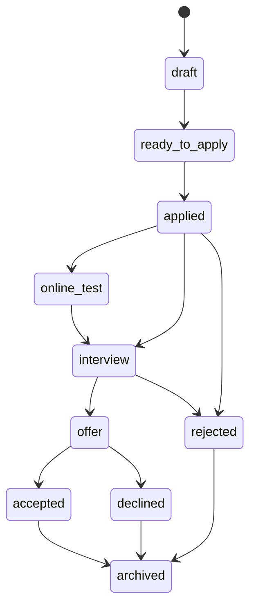

# Tracker, Extension, Settings, Admin Page Specs

## Application Tracker

### Purpose

Track applications and connect outcomes back to strategy.

### Views

- Kanban.
- Table.
- Calendar.
- Company grouped.
- Priority queue.

### Status Machine

### APIs

- `GET /applications`
- `POST /applications`
- `PATCH /applications/:id`
- `POST /applications/:id/status`
- `POST /applications/:id/interview-rounds`
- `POST /applications/:id/outcome`

## Browser Extension

### Purpose

Capture job context and assist applications from job boards.

### Supported Sites

Initial domestic targets:

- Boss Zhipin.
- Liepin.
- Zhilian.
- 51job.
- Lagou.
- Niuke.
- Shixiseng.
- Maimai.
- Generic company career pages.

### Capabilities

- Capture JD.
- Save job target.
- Show match score.
- Copy tailored opening message.
- Assist common fields with user confirmation.
- Open current job in web app.

### Guardrails

- No automatic submission.
- User confirms any field filling.
- Do not scrape unrelated pages.
- Show what data will be sent to the web app.

## Settings

### Pages

- Account.
- Security.
- AI providers.
- BYOK.
- Privacy and data.
- Billing and usage.
- Export/delete account.

### Important Controls

- Export all data.
- Delete all data.
- Disable model logging.
- Select model provider.
- Add API key.
- Manage subscription.

## Admin / Ops

### Purpose

Operate the SaaS safely.

### Views

- Users.
- AI jobs.
- Failed parses.
- Failed exports.
- Model usage.
- Billing events.
- Support diagnostics.

### Guardrails

Admin views must not expose full private resume text by default. Access to raw user materials should be audited and minimized.

